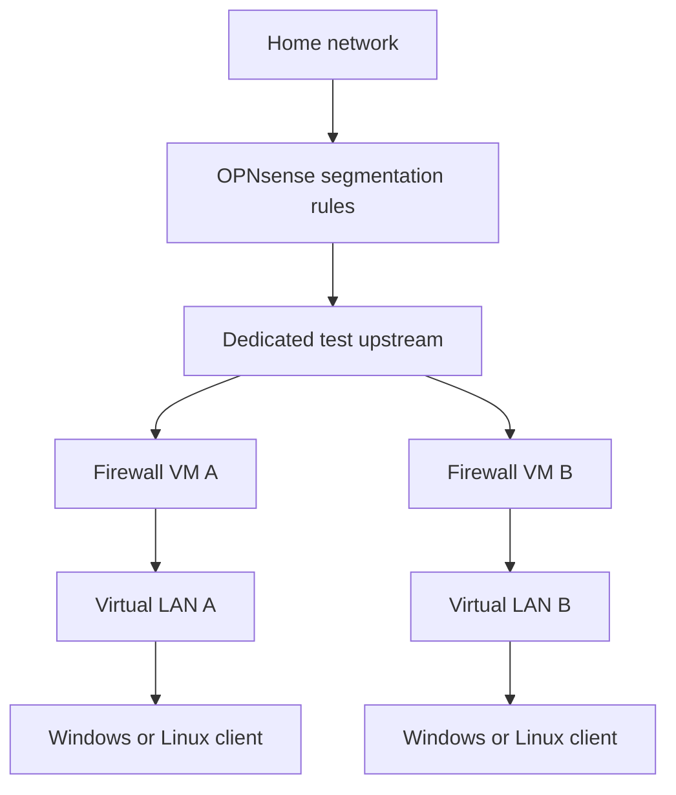

# Proxmox firewall lab layout

```mermaid
flowchart TD
    Home[Home network] --> FW[OPNsense segmentation rules]
    FW --> LabWAN[Dedicated test upstream]
    LabWAN --> F1[Firewall VM A]
    LabWAN --> F2[Firewall VM B]
    F1 --> LAN1[Virtual LAN A]
    F2 --> LAN2[Virtual LAN B]
    LAN1 --> Client1[Windows or Linux client]
    LAN2 --> Client2[Windows or Linux client]
```

I normally run one firewall with the clients needed for a test. Network segmentation and a full security-isolation assessment are separate tasks.
