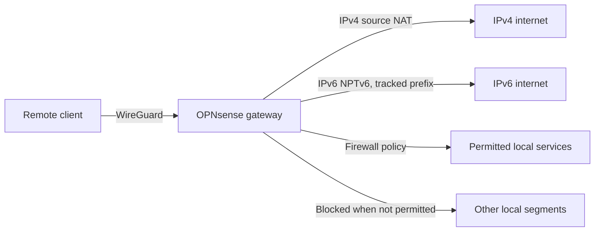

# WireGuard with IPv4 and IPv6

```mermaid
flowchart LR
    Client[Remote client] -->|WireGuard| GW[OPNsense gateway]
    GW -->|IPv4 source NAT| V4[IPv4 internet]
    GW -->|IPv6 NPTv6, tracked prefix| V6[IPv6 internet]
    GW -->|Firewall policy| Core[Permitted local services]
    GW -->|Blocked when not permitted| Restricted[Other local segments]
```

I checked a selected client's full tunnel with the current provider prefix. A real delegated-prefix rotation remains a follow-up test.
